# Audit evidence workflow brief

**Status:** requirements capture; implementation intentionally not started

**Target repository:** `/Users/saqlainmomin/ai_audit_copilot`

**Target commit reviewed:** `db836c301cfdb23396ae633ee7b91599527685e7` on `main`

**Scope source repository:** `/Users/saqlainmomin/dpdpa-gap-tool` (`Cyber`, branch `feat/web-portal`)

## Executive summary

The friend’s application is currently an evidence-request and evidence-review substrate. It already supports a useful part of an audit workflow: an auditor creates an evidence request, assigns it to a stakeholder, sends a magic-link upload request, receives PDF evidence, gets a structured AI triage, previews the file, records a decision, and sees activity history.

It is not yet a complete auditor’s evidence workflow because it has no real control library, scope-driven evidence plan, RFI item approval workflow, evidence-register semantics, design-versus-operating-effectiveness distinction, control-specific analysis, sampling/test procedures, or finding/retest lifecycle. The right product direction is an **AI-assisted audit evidence workbench**, not an autonomous compliance certifier: the AI proposes classifications, mappings, deviations, and follow-up requests; the auditor owns scope, evidence acceptance, conclusions, and release.

This work should be treated as one coherent end-to-end workflow. The scope questionnaire, design RFI, evidence register, design review, operating-effectiveness RFI, and operating review are not independent features from the user’s perspective; each stage produces the inputs needed by the next.

## Intended workflow

```mermaid
flowchart LR
  S[Scope questionnaire] --> C[Approved scope and standards]
  C --> D[Design evidence RFI draft]
  D --> H[Auditor approves, edits, or removes items]
  H --> A[Assign and send requests]
  A --> U[Stakeholder uploads evidence]
  U --> E[Evidence-register candidates]
  E --> R[Design review / desk review]
  R --> G[Auditor confirms deviations and disposition]
  G --> O[Operating-effectiveness RFI draft]
  O --> H2[Auditor approves, edits, or removes tests]
  H2 --> A2[Assign and send operating requests]
  A2 --> OE[Operational evidence and samples]
  OE --> T[Operating review, exceptions, and retest]
```

### 1. Scope the engagement

Start with the existing CyberAssess scope questionnaire. It should establish the engagement context, selected standard(s), in-scope requirements, exclusions, applicability flags, evidence period, entities/systems/processes in scope, and any uncertainty that must remain open rather than silently becoming an exclusion.

The scope result must be reviewable and versioned. A scope change after evidence requests have been issued must not silently rewrite historical requests or invalidate prior auditor decisions.

### 2. Generate the design-evidence RFI

After scope is approved, generate a draft RFI for the documents needed to assess whether controls are designed appropriately. Depending on the standards and selected controls, items may request policies, procedures, standards, process documents, control descriptions, system/configuration documents, architecture diagrams, registers, or formally approved exceptions.

The RFI is a draft until the auditor can approve, edit, remove, or add items. Generated wording must remain anchored to the selected standard and requirement text. The model may improve clarity, but it must not invent a requirement or imply that a policy alone proves operating effectiveness.

### 3. Assign, collect, and register evidence

Approved RFI items become assignable evidence requests. The existing app’s stakeholder, due date, email/magic-link, upload, preview, activity, and request decision behavior should be reused where it fits.

The workflow needs two distinct concepts:

- An **evidence request** asks a person for something.
- An **evidence item/file** is what was submitted and may be a candidate for the evidence register.

The auditor should be able to accept an uploaded file into the evidence register, reject it as irrelevant/insufficient, link it to one or more requirements, request replacement or additional evidence, and add a manual evidence request that was never generated by AI. A single request may receive multiple files and a single evidence item may support multiple requirements, but the audit trail must preserve those relationships.

### 4. Perform design review

The desk review should analyze each accepted design document against the exact in-scope requirements and asserted organizational requirements. It should return:

- the requirement/control reference and version;
- the conclusion for the design question: adequate, partial, inadequate, not applicable, or inconclusive;
- the exact source excerpt and page/section location;
- the deviation from the requirement, if any;
- whether the issue is a missing document, missing clause, ambiguity, contradiction, stale approval, or design weakness;
- confidence and an explicit “auditor must verify” flag;
- suggested follow-up questions or additional evidence.

The desk review is a decision-support step. It must not mark a control compliant solely because a document contains a relevant sentence, and it must distinguish documented intent from evidence that a process operates.

### 5. Generate the operating-effectiveness RFI

Once design review is complete enough to establish what the control is supposed to do, generate a second RFI for operating-effectiveness testing. This RFI should be derived from the approved control design and review observations, not merely copied from the first RFI or generated from generic “provide evidence” language.

Operating requests should describe what the auditor needs to verify in practice: the applicable test period, population or source system, sample criteria, logs, tickets, access reviews, approvals, monitoring output, exception records, configuration exports, or other operational evidence. The auditor must be able to edit the test procedure, sample requirements, and requested evidence before sending it.

### 6. Review operating evidence

Operating evidence needs its own review state and conclusion. The workflow should support pass, fail, partial, exception, insufficient evidence, not applicable, and unable-to-test outcomes, with documented rationale, evidence citations, sample details, management response, remediation/retest, and final auditor sign-off.

## What is reusable now

### From `ai_audit_copilot`

- `apps/api/app/main.py:312-432`: the current request creation and send flow is the starting point for assignable evidence requests, though it needs richer RFI provenance and assignment behavior.
- `apps/api/app/main.py:435-502`: persisted review decisions and activity logging provide a useful human decision gate; the `decided_by` value currently comes from the client and must later be bound to authenticated identity.
- `apps/api/app/main.py:505-672`: engagement, stakeholder, request, file, activity, and signed-preview read paths are the current backend substrate.
- `apps/api/app/main.py:745-948`: the upload-to-storage-to-text-extraction-to-Groq-review pipeline is a useful intake adapter, but it is currently PDF-only, synchronous, generic, and not control-aware.
- `apps/api/app/upload_lookup.py:1-225`: public upload-token resolution and request detail assembly can support stakeholder collection, after token expiry/revocation and authorization rules are made explicit.
- `apps/web/src/components/review/review-panel.tsx:245-430`: the review presentation pattern—AI suggestion only, control mapping, flags, excerpts, and source preview—is a good UI foundation for a richer auditor review panel.
- `apps/web/src/components/upload/request-upload.tsx:83-177`: the stakeholder upload experience and partial-failure handling are useful, though the note field is not persisted and the backend currently only accepts PDFs.
- `apps/web/src/lib/request-status.ts:8-102`: shared request status/count logic is a good pattern to extend into a staged audit state machine.

### From CyberAssess / `Cyber`

- `app/services/scope_profiler.py:45-119,276-318`: applicability computation, excluded-requirement reasons, conditional flags, and evidence checklist generation are directly relevant to scope-to-RFI generation.
- `app/frameworks/schema.py:13-166` plus `app/frameworks/registry.py`: framework/control metadata is a better conceptual source for requirement references, versions, sections, criticality, and framework-specific prompts than free-form request text.
- `app/services/desk_review.py:19-119,143-259`: the pipeline already persists a document catalog, evidence findings, absence findings, signal flags, coverage summary, raw AI response, and statuses.
- `app/dpdpa/prompts.py:213-395`: the prompt shape—exact quotes, source locations, absence detection, signal detection, and structured JSON—is a strong evidence-analysis pattern. It is currently DPDPA-specific and must be generalized or wrapped by framework-specific prompt builders.
- `app/services/question_engine.py:496-676` and `app/services/auto_answer.py`: the “documents describe intent; signals reveal practice” and “signals override pre-fills” ideas are especially relevant to avoiding false confidence during design and operating review.
- `app/services/rfi_generator.py:35-107,192-299`: generation from structured gap items plus a constrained Claude prose pass is reusable as a document-generation pattern, but it currently creates one assessment-level RFI from gaps rather than a versioned, auditor-approved request plan.
- `app/models/rfi.py:12-25` and `app/utils/rfi_export.py:33-176,234-346`: the RFI persistence/export shape can inform client-ready exports, but it is not an evidence-request workflow model.
- `app/utils/review_gate.py:1-17` and the review routes: the existing approval gate is a useful precedent for human release control.

## Important compatibility findings

1. **Framework mismatch.** The target app currently validates `SOC2` and `ISO27001` in `apps/api/app/main.py:149-253`. CyberAssess contains six framework definitions, but its current desk-review service calls DPDPA-specific prompts (`app/services/desk_review.py:19-24` and `app/dpdpa/prompts.py:222-226`). Directly copying the service would produce the wrong analysis for ISO 27001 or SOC 2.
2. **Evidence model mismatch.** The target app has requests and uploaded files but no first-class control library, RFI, evidence-register record, design review, operating test, finding, sample, or retest entity. CyberAssess has rich assessment findings but stores them inside an assessment-oriented pipeline.
3. **RFI purpose mismatch.** CyberAssess’s RFI is an export generated from identified gaps. The requested flow needs an earlier design-evidence RFI generated from scope and controls, then a later operating-effectiveness RFI generated from approved control design and test intent.
4. **AI grounding gap.** The target upload review prompt receives raw extracted text and generic instructions (`apps/api/app/main.py:831-861`); it does not yet receive the request’s control wording, selected framework/version, evidence period, or asserted requirement. That is insufficient for an auditor-grade conclusion.
5. **Traceability gap.** The target frontend supports excerpts and flags, but the current API mapping creates empty excerpts and generic missing-section flags (`apps/web/src/lib/api.ts:153-174`). Design deviations need mandatory citations and structured provenance.
6. **State-machine gap.** The target has request statuses such as `pending_review`, `approved`, and `changes_requested`, but no explicit design-review versus operating-test stages. A stage-aware lifecycle should be designed before adding more statuses.
7. **Security and tenancy gap.** Clerk protects the web route, but the API has no equivalent authorization or engagement scoping. Upload tokens do not currently have an explicit expiry/revocation check, and preview access is not a dedicated audit event. These are blockers for real client evidence.
8. **Reliability gap.** AI processing is synchronous, has no retry/backoff/idempotency workflow, and can leave a stored file without a completed review when extraction or model processing fails. CyberAssess already documents that long synchronous Claude calls caused request holds and token truncation (`01-projects/cyberassess.md:344-350`).
9. **File capability mismatch.** CyberAssess can accept multiple document types and has extraction handling for more than PDF; the target backend currently accepts PDF only. The evidence policy should be decided before changing upload behavior.
10. **Documentation drift.** The target README still says review decisions are not persisted (`README.md:120-123`), while the current code has a `review_decisions` table and endpoint (`apps/api/app/main.py:450-502`). Claude should trust the current code over stale prose and update docs only after the workflow contract is settled.

## Fit to an actual audit workflow

**Today: partial fit.** It is credible for collecting and triaging individual evidence requests, but it behaves more like a polished evidence inbox than an end-to-end audit workpaper system.

**After the proposed workflow: good fit for a human-led design and operating-effectiveness evidence cycle**, provided the product adds control/requirement traceability, scope snapshots, two distinct evidence phases, auditor approval gates, citations, explicit sample/test records, findings and retests, and a complete audit trail. The app should preserve the auditor’s working style captured in CyberAssess: read documents first, form hypotheses, ask pointed questions, probe contradictions, and treat operational signals as stronger than unverified policy intent.

## Open edge cases to resolve before the final plan

These are recommendations, not settled decisions.

1. **Phase boundary:** recommended default is two explicit phases—Design and Operating Effectiveness—inside one engagement, with the second phase linked to the approved design. The alternative is two linked engagements, which gives separation but makes traceability and reuse harder.
2. **Framework scope:** recommended first slice is the target app’s existing SOC 2 and ISO 27001 support, with a framework adapter boundary informed by CyberAssess. Porting all six CyberAssess frameworks at once would expand the product scope substantially.
3. **Scope uncertainty:** an “unsure” answer should keep a requirement in scope and mark it for auditor confirmation, as CyberAssess currently does for conditional DPDPA requirements. It should never silently exclude a control.
4. **RFI governance:** every generated item should be editable and require an explicit auditor approval before assignment/send. The original generated version should remain recoverable.
5. **Assignment granularity:** recommended default is one RFI item maps to one request/owner, while a request may receive multiple files. A later enhancement can support multiple owners for one item if actual engagements need it.
6. **Evidence registration:** recommended default is “uploaded file = candidate; auditor acceptance = evidence register.” Do not make every upload automatically accepted evidence.
7. **Evidence reuse:** recommended default is many-to-many links between evidence and requirements/stages, with the evidence’s original provenance preserved. Reusing a design document in the operating phase should be allowed only as contextual evidence, never as proof of operation by itself.
8. **AI authority:** recommended default is suggestion-only. The AI may classify, map, flag, and draft; it may not approve evidence, close a finding, declare compliance, select final samples, or release a report.
9. **Design-review outcome:** recommended default is separate “documented design conclusion” from “implementation/operation conclusion.” A well-written policy can pass the first and remain untested for the second.
10. **Operating RFI generation:** recommended default is generate a proposed test plan per approved design/control, then require auditor confirmation of period, population, sample method, evidence types, and expected result before sending.
11. **Reruns and versions:** recommended default is immutable review runs and RFI versions. A new scope, framework version, document version, or prompt/model run creates a new version and never overwrites a signed-off conclusion.
12. **Exceptions and retest:** recommended default is a finding lifecycle of open → management response → remediation evidence → retest → closed/accepted risk, with the original finding and evidence remaining visible.
13. **Client response behavior:** decide whether one upload link accepts only the named evidence item or allows related evidence. Recommended default is named item plus “additional related files,” all requiring auditor triage.
14. **Non-machine-readable evidence:** decide whether to support DOCX, spreadsheets, images, and OCR in the first implementation. Recommended default is PDF plus text-based DOCX first, with images/OCR explicitly marked as a later slice unless the friend’s existing clients require them.
15. **Engagement edits:** decide whether standards, scope, or evidence period can change after requests are sent. Recommended default is allow changes through a new scope/RFI version and warn about affected requests, rather than mutating history.

## Next decision

The highest-impact edge case is the phase boundary because it affects nearly every downstream relationship:

**Should Design Review and Operating-Effectiveness Testing be two explicit phases inside one engagement (recommended), or two separate engagements linked together?**

Once that is decided, the next questions can be taken one at a time and the final requirements/implementation plan can be split cleanly between Claude and Codex.
